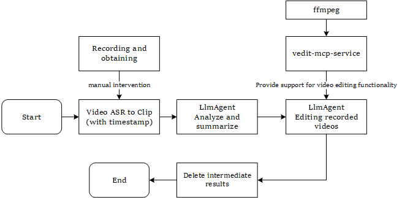

# Auto - Slicing

Automated Slicing: This is a project that realizes the automated slicing of recorded videos through ASR + LLM Agent.

[English](README.md) | [简体中文](README_cn.md)

## 👀Quick Start

### 1. Install Dependencies

#### 1.1 Clone the project or download the zip package directly

Prerequisites:
- Video memory >= 16GB. I haven't tried with less.
- Memory >= 32GB.

#### 1.2 Configure the Python environment

Python version: Theoretically, Python `3.9 - 3.12` can be used. There were some problems with `3.13` before, and it's not clear if they have been fixed now.

1. It is recommended to use uv to install

```bash
cd vedit - mcp
uv pip install - r requirements.txt
```

2. Or directly use pip to install

```bash
pip install - r requirements.txt
```

#### 1.3 Configure ffmpeg

`vedit - mcp` depends on `ffmpeg` to work, so please configure ffmpeg.

```bash
# Ubuntu
sudo apt update
sudo apt install ffmpeg
```

#### 1.4 Download ASR model weights

- For audio analysis, including speech recognition and speech interruption detection. Please refer to:
  - https://github.com/FunAudioLLM/SenseVoice
  - [modelscope - iic/SenseVoiceSmall](https://www.modelscope.cn/models/iic/SenseVoiceSmall) - corresponding to SENSE_VOICE_MODEL_PATH
  - [modelscope - icc/vad_fsmmn](https://www.modelscope.cn/models/iic/speech_fsmn_vad_zh - cn - 16k - common - pytorch/summary) - corresponding to SENSE_VOICE_VAD_MODEL_PATH

Note: This part currently only supports local inference, and the API method may be supported in the future.

#### 1.5 Configure environment variables

```bash
cd auto - slicing/src
cp .env.example .env
```

Edit the `.env` file and modify some configurations according to the actual situation.

Note: Currently, this script uses the API of the [Volcano Ark Platform](https://www.volcengine.com/product/ark), so both API_BASE and API_KEY are from this platform.
1. `OPENAI_API_BASE`: Currently, it is the api - base of the Volcano Ark Platform.
2. `OPENAI_API_KEY`: It is recommended to configure it directly using environment variables to prevent leakage. Of course, it can also be configured directly here.
3. `OPENAI_MODEL` and `OPENAI_MODEL_THINKING`: Model names, please adjust according to the actual situation.
4. `SENSE_VOICE_LOCAL_MODEL_PATH`: Modify it to the address of the sense_voice model weights you downloaded.
5. `SENSE_VOICE_LOCAL_VAD_MODEL_PATH`: Modify it to the address of the vad_model weights you downloaded.
6. `KB_BASE_PATH`: The basic path for slice processing. All files will be relative to this path.

Note: Absolute paths are recommended for the above paths.

### 2. Start the project

#### 2.1 Parameter configuration

Please modify the query part in `src/main.py` according to your needs.

Note: `raw_video` must be a path relative to `KB_BASE_PATH`. This design is to reduce the possibility of path errors during the call of the large model.

```bash
cd src
python main.py
```

## 🫡Introduction to the Implementation

The overall architecture diagram is as follows.



For the specific implementation, you can directly refer to the `src/processor` part of the code. This is the entry point of each module, and the overall idea is very clear in the diagram.

## ✅TODO LIST
- [ ] Graphical interface. Consider using streamlit to create a graphical interface.
- [ ] Expand `vedit - mcp`. Currently, it only supports basic editing functions and needs further support.
- [ ] Add subtitle - adding function.
- [ ] Add the API call method for speech recognition.

## 🔥Latest News

None.