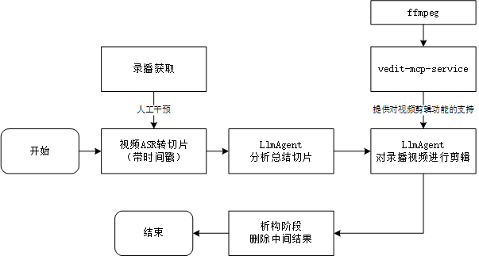

# auto-slicing

自动化切片：这是一个通过ASR+ LLM Agent实现自动化录播视频切片的项目。

[English](README.md) | [简体中文](README_cn.md)

## 👀快速开始

### 1. 安装相关依赖

#### 1.1 clone本项目或者直接下载zip包

前提条件：

- 显存>=16GB，更小的本人并没有试过

- 内存>=32GB


#### 1.2 配置python环境

python版本：理论上python  `3.9~3.12`均可，`3.13`之前遇到过一些问题，不太清楚现在是否已经修复


1. 推荐使用uv安装

```bash
cd vedit-mcp
uv pip install -r requirements.txt
```


2. 或者直接pip安装

```bash
pip install -r requirements.txt
```


#### 1.3 配置ffmpeg

本项目剪辑部分是由[`zakahan/vedit-mcp`](https://github.com/zakahan/vedit-mcp)实现的，该部分依赖`ffmpeg`实现，因此请配置ffmpeg

```bash
# ubuntu
sudo apt update
sudo apt install ffmpeg
```


#### 1.4. 下载ASR模型权重

- 音频解析使用，分别是语音识别和语音中断检测，请参考
  - https://github.com/FunAudioLLM/SenseVoice
  - [modelscope-iic/SenseVoiceSmall](https://www.modelscope.cn/models/iic/SenseVoiceSmall) - 对应SENSE_VOICE_MODEL_PATH
  - [modelscope-icc/vad_fsmmn](https://www.modelscope.cn/models/iic/speech_fsmn_vad_zh-cn-16k-common-pytorch/summary) - 对应SENSE_VOICE_VAD_MODEL_PATH

注：此部分目前仅支持本地推理，api方式可能会在后续支持


#### 1.5. 配置环境变量

```bash
cd auto-slicing/src
cp .env.example .env
```

编辑`.env`文件，修改部分配置为实际情况

注：目前本脚本采用的是[`火山方舟平台`](https://www.volcengine.com/product/ark)的api，因此API_BASE和API_KEY都使用的是该平台。

1. `OPENAI_API_BASE`：当前为火山方舟平台的api-base
2. `OPENAI_API_KEY` ：推荐直接使用环境变量配置，防止出现泄露问题，当然也可以直接在这里配置
3. `OPENAI_MODEL`与`OPENAI_MODEL_THINKING`：模型名称，请根据实际情况来
4. `SENSE_VOICE_LOCAL_MODEL_PATH`：修改为您所下载的sense_voice模型权重地址
5. `SENSE_VOICE_LOCAL_VAD_MODEL_PATH`：修改为您所下载的vad_model权重地址
6. `KB_BASE_PATH`：切片处理的基础路径，所有的文件都会相对于当前路径

注：以上路径均推荐使用绝对路径


### 2. 启动项目

#### 2.1 参数配置

请修改 `src/main.py`中的query部分，修改为你需要的

注意：`raw_video`必须为相对于`KB_BASE_PATH`的路径，这样设计是为了减少大模型在调用过程中对出现路径错误的可能性。


```bash
cd src
python main.py
```


## 🫡实现介绍

整体架构图如下



具体直接看代码`src/processor`部分即可，这里是每个模块的入口，整体的思路在图上已经很清晰了。


## ✅TODOLIST

- [x] 图形化界面，考虑用streamlit做一个图形化界面
- [ ] 实现对asr api的支持，脱离本地推理限制
- [ ] 扩展`vedit-mcp`，目前仅支持基本的剪辑功能，需要继续提供支持
- [ ] 增加添加字幕功能
- [ ] 添加语音识别的API调用方法
- [ ] 增加封面生成功能，先搞个简陋版的
- [ ] 考虑对歌回的支持
- [ ] 考虑使用说话人分离，实现对游戏回、看视频回等声音信号不唯一情景的支持


## 🔥Latest News

- 2025-05-08, 使用streamlit实现了简易的webui界面