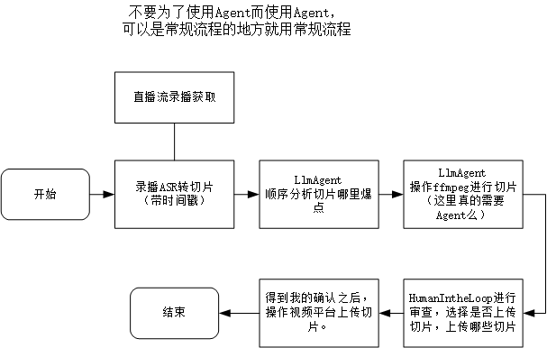

### 自动切片项目

大概就是想用Agent + ASR技术实现一波自动切片的流程。

模式大概是这样的，

1. 视频流获取：首先获取录播或者直播信息流，逐句执行ASR。
2. 存储记录：每条信息记录为一个chunk，并且标记时间点。
3. 将ASR后的文本信息提交给LLM，让其确定哪条信息是值得切片的，然后记录时间范围，并且总结信息，构建视频标题和封面之类的（他妈的封面怎么搞？想不明白了），可能还要涉及到嵌字的问题。
4. 让用ffmpeg做剪辑切片，根据提供的定位时间片段信息，可以采用一些策略，比如爆典了就先前情提要，比如歌回就硬切就行了。
5. 切完LLM用Agent的方式操纵bilibili上传切片。

大概是这样吧。感觉就是这样？目前看是3、4、5涉及到Agent，其中3是更涉及到一点LLM能力的。

呃，最后就是要有一点行动力！！！！

再加上一点坚持！！！不能做了之后就拉倒了。

